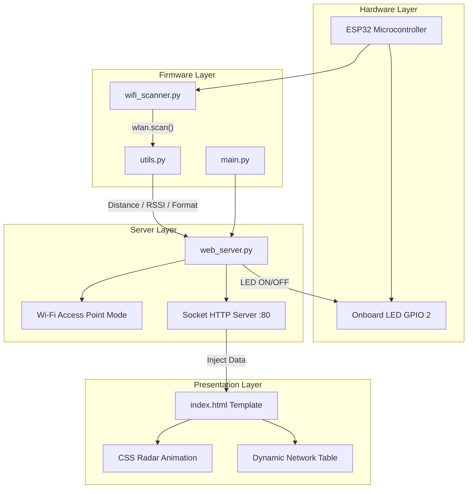

<div align="center">

# 📡 WiFi Radar
### ESP32-Powered Wi-Fi Signal Analyzer🛰️⚡


[](https://micropython.org/)
[](https://www.espressif.com/)
[](https://developer.mozilla.org/en-US/docs/Web/HTML)
[](https://developer.mozilla.org/en-US/docs/Web/CSS)

**WiFi Radar** is a real-time tactical Wi-Fi network scanner built on the **ESP32 microcontroller** using **MicroPython**. It hosts its own Wi-Fi Access Point and serves a live, radar-styled intelligence dashboard — no internet, no router, no external dependencies required.

</div>

---

## 📖 Project Overview

WiFi Radar transforms your ESP32 into a **standalone signal intelligence unit** — scanning the airwaves for all nearby networks and serving a beautiful, auto-refreshing web dashboard over its own hotspot.

### Core Value Proposition
- **📡 Zero-Infrastructure Scanning**: Self-hosted AP means no router needed
- **🔍 Deep Network Intelligence**: SSID, MAC address, channel, RSSI, security type
- **📏 Distance Estimation**: Physics-based FSPL distance calculation per network
- **🚨 Proximity Alert System**: Real-time flashing alert for extremely close targets
- **💡 Physical LED Feedback**: Onboard LED indicates active client connection
- **🎯 End-to-End Standalone**: Hardware → Firmware → Web UI, all in one device

---

## 🏗️ System Architecture



---

## 🚀 Key Features

### 📶 Tactical Network Scanner
- Detects **all nearby Wi-Fi networks** using `WLAN(STA_IF).scan()`
- Sorted by signal strength — **strongest first**, always
- Handles hidden SSIDs gracefully

### 📊 Live Signal Intelligence Dashboard
- Real-time tracking of:
  - SSID (Network Name)
  - MAC Address (BSSID)
  - Wi-Fi Channel
  - Signal Strength (RSSI in dBm)
  - Estimated Physical Distance (meters)
  - Security Type (Open / WEP / WPA / WPA2 / WPA3)

### ⚡ Zero-Latency Background Cache
- Wi-Fi scanning occurs entirely in the background during idle periods
- Client requests are served **instantly (<100ms)** from a pre-scanned memory cache, completely eliminating connection timeouts

### 🕵️ Client Interception & Persistent Logging
- **Device Fingerprinting:** Automatically parses User-Agents to detect device type (iPhone, Android, Windows) and browser
- **MAC Address Extraction:** Resolves the physical hardware MAC of connected clients
- **Flash Memory Persistence:** All client connections are logged to `client_log.txt` directly on the ESP32's non-volatile flash memory, surviving power cycles
- **Headless Powerbank Mode:** Designed to be run from a portable battery pack, allowing later retrieval of intercepted client data via the `/log` HTTP route

### 📏 Distance Estimator
- Uses **Free Space Path Loss (FSPL)** formula tuned for 2.4GHz
- Gives a meaningful meter estimate per detected access point

### 🚨 Proximity Alert System
- Flashing red banner triggered when signal exceeds **-45 dBm**
- Indicates a target router is within a few feet of the device

### 💡 Hardware-Aware LED Indicator
- Onboard LED (GPIO 2) tracks actual physical `ap.status('stations')` associations, perfectly mirroring true client presence

### ⏱️ System Uptime Tracker
- HUD stat box tracking exact **minutes and seconds** since boot

### 🎯 Primary Target Lock
- Strongest network is **highlighted** and labeled `[PRIMARY TARGET]` with a pulsing animation

---

## 🛠️ Technology Stack

| Layer | Technologies |
|---|---|
| **Firmware** | MicroPython (ESP32), `network`, `socket`, `machine`, `gc`, `time` |
| **Hardware** | ESP32 DevKit, Onboard LED (GPIO 2) |
| **Web UI** | HTML5, Vanilla CSS3, CSS Animations, Google Fonts |
| **Protocol** | Raw HTTP/1.1 over TCP Socket, Wi-Fi AP Mode |

---

## 📂 Project Structure

```text
wifi_radar_scanner/
│
├── main.py           # Entry point — initializes and starts the web server
├── wifi_scanner.py   # Wi-Fi scanning logic (Multi-pass background scanning strategy)
├── web_server.py     # Cache-based HTTP socket server, client fingerprinting, HTML injection
├── utils.py          # RSSI → distance, signal %, color class, MAC formatter
├── logger.py         # Persistent flash memory file logging for client intercepts
├── config.py         # Centralized configuration (AP name, passwords, thresholds, pins)
├── index.html        # Radar dashboard HTML/CSS template
│
└── README.md         # This file
```

---

## 🚀 Getting Started

### Prerequisites
- ESP32 development board (any variant with Wi-Fi)
- Micro-USB / USB-C **data cable** (not a charge-only cable)
- [Thonny IDE](https://thonny.org/) — beginner-friendly MicroPython uploader
- MicroPython firmware flashed on the ESP32

---

### 1. Flash MicroPython (if not already done)

Open **Thonny → Tools → Options → Interpreter** and select `MicroPython (ESP32)`. Thonny will offer to install firmware automatically. Alternatively, use `esptool`:

```bash
pip install esptool
esptool.py --chip esp32 erase_flash
esptool.py --chip esp32 write_flash -z 0x1000 esp32-firmware.bin
```
> 📥 Download firmware: [micropython.org/download/esp32](https://micropython.org/download/esp32/)

---

### 2. Clone or Download the Project

```bash
git clone https://github.com/Priyan-19/wifi-radar-pro.git
cd wifi-radar-pro
```

---

### 3. Upload Files to ESP32

1. Open **Thonny**
2. Go to **View → Files**
3. In the "This computer" panel, navigate to the `wifi_radar_scanner/` folder
4. Select all 6 files → Right-click → **"Upload to /"**

Your ESP32 filesystem should contain:
```
/main.py
/wifi_scanner.py
/web_server.py
/utils.py
/config.py
/index.html
```

---

### 4. Run the Radar

Press the **EN / RST** button on your ESP32. Watch the Thonny Shell:
```
========================================
      WiFi Radar Scanner Started
========================================
Access Point started!
Connect to Wi-Fi network: 'ESP32_WiFi_Radar'
Then open browser to http://192.168.4.1
Web server listening on ('0.0.0.0', 80)
```

---

### 5. Connect & View Dashboard

1. On your phone or laptop, connect to Wi-Fi: **`ESP32_WiFi_Radar`** *(no password)*
2. Open browser → navigate to **`http://192.168.4.1`**
3. The radar dashboard loads and **auto-refreshes every 5 seconds** 🎯

---

## 🔑 Default Access

| Setting | Value |
|---|---|
| AP Network Name | `ESP32_WiFi_Radar` |
| AP Password | *(None — Open Network)* |
| Dashboard URL | `http://192.168.4.1` |
| Refresh Rate | Every 5 seconds |

---

## 🔧 Hardware Configuration

| Component | Detail |
|---|---|
| Microcontroller | ESP32 DevKit V1 (any variant) |
| LED Pin | GPIO 2 (Onboard LED) |
| Wi-Fi Mode | AP (Access Point) + STA (Scanner) simultaneously |
| Server Port | 80 (HTTP) |

> ⚠️ **Note**: The ESP32 must have its onboard LED on GPIO 2. Some boards use GPIO 0 or GPIO 5 — check your specific board's pinout diagram.

---

## ⚙️ Configuration Reference

All tuneable settings live in **`config.py`** — edit that single file before uploading:

| Parameter | Default | Description |
|---|---|---|
| `AP_SSID` | `ESP32_WiFi_Radar` | Hotspot broadcast name |
| `AP_PASSWORD` | `""` (open) | Set any string to enable WPA2 |
| `SERVER_PORT` | `80` | HTTP port |
| `LED_PIN` | `2` | Onboard LED GPIO pin |
| `LED_TIMEOUT_MS` | `8000` | Idle time before LED turns off |
| `PROXIMITY_THRESHOLD_DBM` | `-45` | Alert trigger signal level (dBm) |
| `CHUNK_SIZE` | `512` | HTTP response chunk size (bytes) |

---

## 📐 Technical Details

### Distance Calculation
Uses a simplified **Free Space Path Loss (FSPL)** formula for 2.4GHz indoor environments:
```
Distance (m) = 10 ^ ((|RSSI| − 40.09) / 20)
```

### Signal Percentage
Maps RSSI to a `0–100%` scale for the CSS progress bar:
```
Percentage = 2 × (RSSI + 95)   [clamped between 0 and 100]
```

### LED Behavior
| State | Meaning |
|---|---|
| 🟢 ON | Client requested page within last 8 seconds (actively viewing) |
| ⚫ OFF | No requests for 8+ seconds (tab closed or disconnected) |

### `wlan.scan()` Tuple Format
```python
(ssid, bssid, channel, RSSI, authmode, hidden)
#  [0]    [1]     [2]    [3]     [4]      [5]
```

---

## 🔒 Security & Reliability

- **Server-side rendering**: No JavaScript execution on the ESP32 — pure HTML injection
- **Chunked HTTP response**: Sends HTML in 512-byte blocks to prevent memory overflow
- **Garbage collection**: `gc.collect()` called after every request to keep RAM free
- **Socket timeout**: 1-second `settimeout` prevents the server from hanging indefinitely
- **Error isolation**: All errors are caught per-request — server never crashes on a single bad client

---

## ⚠️ Known Limitations

- **Estimated distance only**: Indoor walls, interference, and antenna variation affect accuracy
- **Single client at a time**: MicroPython socket handles one connection per loop cycle
- **No internet routing**: The AP does not forward traffic to the internet
- **Google Font dependency**: Falls back to monospace if the connected device has no internet (layout still works fine)
- **2.4GHz only**: ESP32's built-in radio only supports 2.4GHz band scanning

---

## 🚀 Recent Enhancements

- **Zero-Latency Cache Architecture** — The server no longer blocks while scanning. Browsers receive data instantly from the background cache, entirely eliminating `ERR_CONNECTION_TIMED_OUT`.
- **Persistent Flash Logger (`/log`)** — Connect the ESP32 to a portable power bank, let people connect, and view the intercepted client data later via the `/log` streaming endpoint.
- **Client Fingerprinting** — Added User-Agent parsing to automatically detect Android/iOS/Windows/Mac devices and their browsers, displayed directly in the UI.
- **Multi-pass Scan Strategy** — Implemented a 3-pass scan with BSSID deduplication to overcome the ESP32's AP+STA channel-dwell hardware limitation, ensuring no networks are missed.
- **Hardware-Precise LED** — Upgraded LED logic from a timeout heuristic to a direct `ap.status('stations')` association check for perfect synchronization.
- **RAM-Safe Streaming** — Both the HTML generation and the new `/log` endpoint now heavily utilize `gc.collect()` and byte-chunked socket streaming to run stably within MicroPython's tight memory limits.

---

## 🤝 Contributing

Pull requests are welcome! Ideas for future improvements:
- 📟 OLED display output for local readings
- 🌙 Deep sleep mode for battery-powered deployment
- 🔔 Sound buzzer alert for proximity events
- 📅 Reading history log stored to ESP32 flash
- 📊 AJAX polling to replace meta-refresh (no page blink)
- 🏷️ Vendor OUI lookup to identify device manufacturers

---


<div align="center">
  <p>Built with 📡 for the Curious and the Hackers</p>
  <p>Developed by <strong>Priyan-19</strong></p>
  <p>© 2026 WiFi Radar. All Rights Reserved.</p>
</div>
